# RossAnthonyDesigns - ForgedNature

## E-Commerce store for a local sculptor
------------------------------------

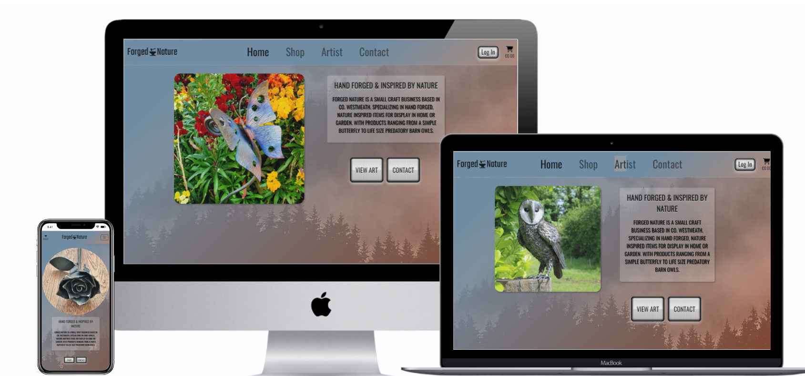

### Live site available [here](https://rossanthonydesigns.herokuapp.com/). 

-----

## Table of Contents
--------------------------------------

- [Description](#description)
- [Design](#design)
- [UX](#ux)
- [Agile Development](#agile-development)
- [Web Marketing](#web-marketing)
- [Features](#features)
- [Testing](#testing)
- [Technologies](#technologies)
- [Deployment](#deployment)
- [Credits](#credits)
- [Acknowledgements](#acknowledgements)
- [Author Info](#author-info)

------

## Description
---------------------------------------

RossAnthonyDesigns - ForgedNature is a fully functional E-Commerce store built in Django using Python, JavaScript, CSS, Bootstrap5, HTML and it incorporates stripe payments.
The site provides role based permissions for users to interact with a central dataset. It includes user authentication and Full CRUD functionality for products.

Forged Nature is a small craft business based in Co. Westmeath.
Specializing in hand forged, nature inspired items for display in home or garden.
With products ranging from a simple Butterfly to life size predatory Barn Owls.

This version has been built for project 5 of the Code Institute Diploma in Software Development and therefore doesn't accept real payments and any orders made won't be fulfilled.

But a fully operational live site will be released soon under the url: www.rossanthonydesigns.ie

If you would like to test the payment functionality please feel free to do so by entering the card details below when prompted:

`Card number: 4242 4242 4242 4242  Exp: any future date eg. 11/26 CVC: any 3 digits eg 123`

[Back to the Top](#table-of-contents)

-------
## Design
-------

### Wireframe mock-ups
---
Home page: 

The home page provides the user with a clear understanding as to the purpose of the site. 

The welcome message is clearly visable to the user when they first arrive at the site regardless of the device they are using.

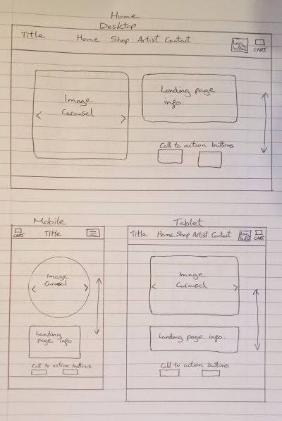

Shop Page:

Users have the ability to view information on available products and add them to a cart for purchase. 

The emphasis of the design is to provide a clear layout that can adapt to any size device.

Users will have the ability to order products by price, Asc & Desc. 

To aid in the user experience users have the ability to open up a seperate page on each item for sale.

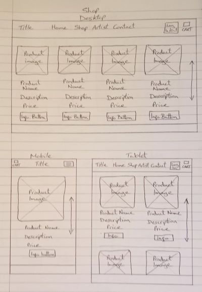

Artist Page:

Users can view a page dedicated to the artist himself, this page includes basic information and photos, aswell as a contact form used for basic communication or requests for commissions.

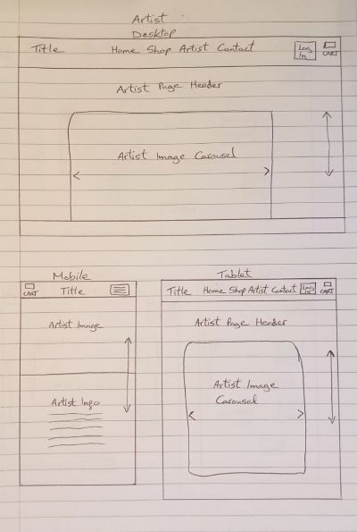

Cart Page:

Users can view a cart with their chosen items, it includes a total price for items in the cart, delivery cost and grand total (price + delivery)

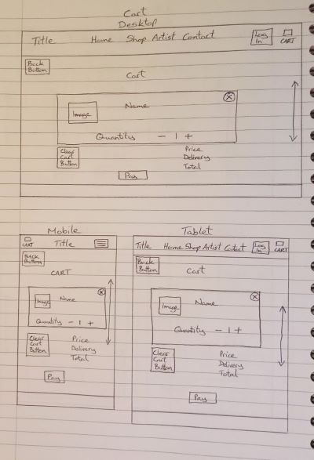

Checkout Page:

The checkout page will include a summary of items in the cart and all relevant information needed for a successful order ie. Contact Details, Delivery Details & Payment Details.

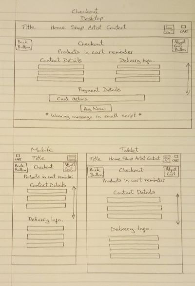

Site Footer:

The Footer is responsive and universal across the site, it includes a newsletter signup form, contact information and social media links.

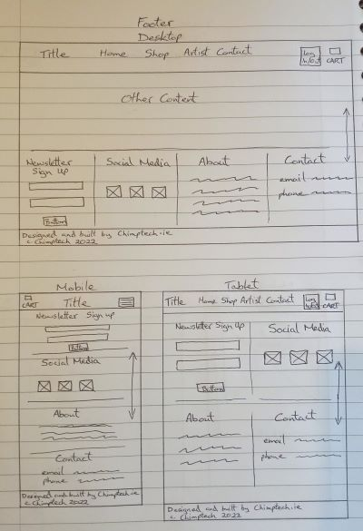

Wireframes were also produced for each major page for both mobile and tablet devices. 
With the intention of the site being fully responsive so that no matter the device size the user is viewing the site on, it will display accordingly.

* [Individual product wireframe](./docs/single-item-wireframe.jpg)
* [Form page wireframe](./docs/forms-wireframe.jpg)
* [Error/Delete/Success page wireframe](./docs/error-success-wireframe.jpg)
* [Dashboard wireframe](./docs/dashboard-wireframe.jpg)

[Back to the Top](#table-of-contents)

---
## Database Schema

Several custom models were predicted to be required when building the site. On top of the standard Sculpture/Order models these included a Newsletter signup Model a Message Model and a customer Review model. The database schema was drawn out by hand.

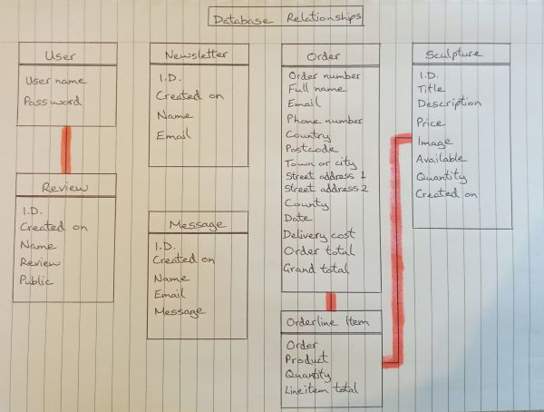

Once I was happy with the overall structure of the site, and the layout of the wireframes, I selected the colour scheme. The colour schemes were checked for colour contrast to ensure that the appropriate colours were used for a high level of colour contrast to maximise accessibility for users.

These colours were:

Grey/Blue: #6f8ca2

Dusty Orange: #ff85436b

Whitesmoke: #f5f5f5

And Bootstraps Text-Muted class for sligtly greyed out text.

[Back to the Top](#table-of-contents)

---

## UX
*  RossAnthonyDesigns was designed to be a friendly and informative site for users to easily browse and find products they would be interested in purchasing. The graphical elements and overall design of the site provide the user with a fun and enjoyable environment.

### The Sites Ideal User
* Someone looking to purchase or commission a Sculpture
* Someone looking for inspiration for a crafty project

### Site Goals

* To provide the site owner with a place to sell his work.
* To provide the site owner with a place to showcase his work and expand his digital presence.
* To provide users with an enjoyable and easy to use site for making purchases.

[Back to the Top](#table-of-contents)

## Agile Development

The plan for this project was carried out using the Agile Methodology in Github. User Stories were created using issues on git hub. Each user story explicitly explains the purpose of the issues. Each user story is segmented into acceptance criteria and tasks. It was prioritised using GitHub labels with different colors.

9 Epics were created which were then further developed into 29 User Stories. The details on each epic, along with the user stories linked to each one can be found in the project kanban board [here](https://github.com/users/KSheridan86/projects/4)

From the Epics, 29 User stories were developed. Each story was assigned a classification of Must-Have, Should-Have, Could-Have or Won't Have. Each story was also assigned user story points, based on my best estimation for the time/difficulty of completing each story. In practice some of these tasks were completed much quicker than anticipated and others took a little longer but overall the development went smoother than anticipated and the project was completed ahead of schedule. A number of these stories were chosen to be left out of the project as it was already quite big (I.E social media login).

### Epics

1. Sign in/out [#1](https://github.com/KSheridan86/project-5-RossAnthonyDesigns/issues/1)
2. Landing page/Frontend Templates [#2](https://github.com/KSheridan86/project-5-RossAnthonyDesigns/issues/2)
3. View Products/Admin CRUD functionalikty [#3](https://github.com/KSheridan86/project-5-RossAnthonyDesigns/issues/3)
4. Shopping Cart [#4](https://github.com/KSheridan86/project-5-RossAnthonyDesigns/issues/4)
5. User Feedback [#5](https://github.com/KSheridan86/project-5-RossAnthonyDesigns/issues/5)
6. Payments [#6](https://github.com/KSheridan86/project-5-RossAnthonyDesigns/issues/6)
7. User Profile [#7](https://github.com/KSheridan86/project-5-RossAnthonyDesigns/issues/7)
8. Contact Artist/Social links [#8](https://github.com/KSheridan86/project-5-RossAnthonyDesigns/issues/8)
9. Customer Reviews [#9](https://github.com/KSheridan86/project-5-RossAnthonyDesigns/issues/8)

### User Stories

These are the user stories that were completed within the projects first release, by Epic.

- User Sign in or Sign out
	*  User Account Login / Logout - As a User, I would like to be able to login or logout of my account, so that I can avail of the sites full functionality
	*  Receive Welcome Emails - As a user I would like to receive a welcome email upon signing up
    *  Reset password Functionality - As a user I would like to be able to reset my password to keep my account safe
    *  Visibly logged in or out - As a user I would like to know if I am logged in or not

- Landing page
	*  As a User I would like to be brought to the landing page upon first visiting the site so that I can see what options are available to me
    *  As a User from the landing page I should clearly be able to see and navigate the navbar
    *  As a User on the landing page I should be easily able to go straight to the shop and purchase an item

- View Products, Admin CRUD
    *  As a user I should be easily able to see a list of products available.
    *  As a user I should be able to click on any item to see more information about it.
    *  As an Admin I can add products to the database
    *  As an admin I can edit products in the database
    *  As an admin I can delete products from the database

- Shopping Cart
    *  As a user I can easily view the contents of my Cart
    *  As a user I can easily add/edit/delete the contents of my Cart
    *  As a user I can easily identify the total cost of my Cart

- User Feedback/Confirmation
    *  As a user I receive prompt feedback concerning my actib=vity on the site
    *  As a user I can see a order confirmation message
    *  As a user I receive an order confirmation email

- Payment Feature
    *  As a user I can visit a payment screen
    *  As a user I can input my credit/debit card details

- User Profile
    *  As a user I can sign in/create a profile so that I can avail of the sites full functionality ie. leave customer reviews

- Contact Artist/Social links
    *  As a user I can signup to a Newsletter
    *  As a user I can fill out a contact form
    *  As a user I can clearly see contact information
    *  As a user I can easily find social media links and when pressed they take me to the correct site

- Customer Reviews
    *  As a user I can clearly see reviews left by past customers
    *  As a user who is logged in I can easily leave a review

[Back to the Top](#table-of-contents)

---

## Web Marketing

#### **E-Commerce Application Type**
Forged Nature is a B2C e-commerce application. Selling directly to consumers means that the site is designed to sell quickly, on impulse, and in smaller quantities. While wholesale is a possible future goal, the website was not yet intended to sell to other businesses. For this reason, a large amount of the functionality is focused on the user experience and the ability to purchase products quickly and effectively

#### **Marketing Strategy**
As Forged Nature is a start-up business, the budget for marketing is limited. However, there are several ways that Forged Nature can market itself to help increase sales and brand awareness. Using Facebook to pump out content and drive traffic is the first and most straightforward. The use of paid ads allows the business to target specific demographics and increase brand awareness. The use of social media is also a great way to get feedback from customers and to help with customer service. There is an image of the Facebook page below and a link to the page [here](https://www.facebook.com/forged.nature.irl).

The second is the use of google ads which are a great way to increase brand awareness and help with SEO. The use of google ads can also help with the use of long-tail keywords and help with the ranking of the site.

The third is the use of influencers. Influencers are a great way to increase brand awareness. Free samples could be sent to popular influencers on youtube in exchange for a mention/hashtag/ link in the description. This further helps raise brand awareness because the video could be posted on Facebook and the influencer tagged in the post, which with the help of the Facebook algorithm, would help bring an organic audience to the Facebook page and, hopefully, the store.

The final method would then be sending regular news letters to the mailing list obtained via the signup form. The newsletter would contain links to recent articles, the latest products, special offers and promotions. This would help with brand awareness building a community around the brand.

#### **Search Engine Optimization**
SEO research is key to driving traffic from a browser based search i.e. Google to the website. The keyword research has played a crucial role in incorporating words that users typically search for when seeking to purchase art online. To help improve the search engine ranking I ensured the site carries meta tags for a description and keywords which encapsulate the general content and focus of this B2C site.

#### **XML Sitemap**
Additionally to help the search engines crawl the website, I've added an XML sitemap file to the main root directory. The file was created using the free service through XML-Sitemaps.com. A sitemap is a way of organizing a website, identifying the URLs and the data under each section. Previously, the sitemaps were primarily geared for the users of the website. However, Google's XML format was designed for the search engines, allowing them to find the data faster and more efficiently.

A robots.txt file has also be included in the build to tell the search engine crawlers which URLs the crawler can access on this site. This is used mainly to avoid overloading the site with requests.

#### **Facebook Page**
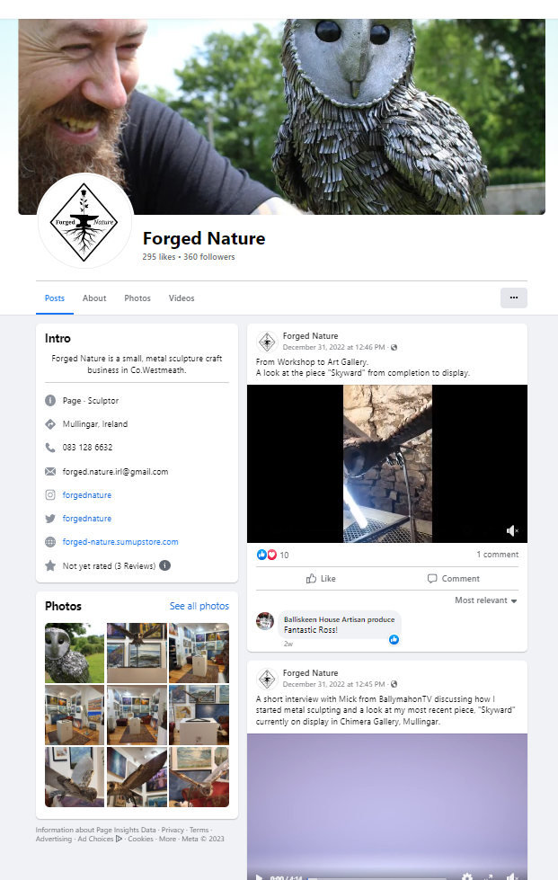

---

## Features

**Features planned:**
* User Profile - Create an account to leave customer reviews.
* Users can login to their account.
* Users can logout of their account.
* Users can sign up to a Newsletter
* Users can easily contact the site owner by filling in a contact form
* Users can easily see the products available by navigating to the shop page
* Logged in users can leave reviews of past purchases
* Users can add/edit/delete items in a shopping cart
* Users can finalize their purchase by inputting their card details and recieve order confirmation
* Users can view information about the artist
* Products - Admin can create, read, update and delete their own products.
* Responsive Design - the site needs to be fully responsive to cover the wide variety of devices users may use to access an E-Commerce site.

---
#### Home page
A welcoming homepage was built to welcome the user to the site and clearly convey the sites purpose. The call to action buttons for the user to go straight to the shop or contact the site owner is at the top of the main page, just below a large welcome message.

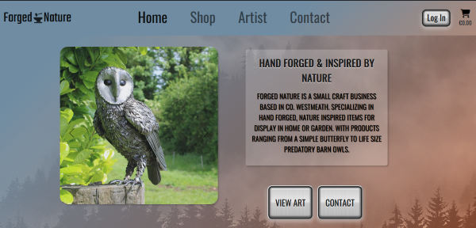

#### Navigation Bar
The main navigation bar appears at the top of the page, clearly displaying the main navigational links users would require.

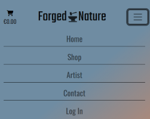

#### Footer
A common footer is utilised throughout the site.
The name ChimpTech.ie is a domain owned by me and in the near future will host my projects and begin to advertise web development services.

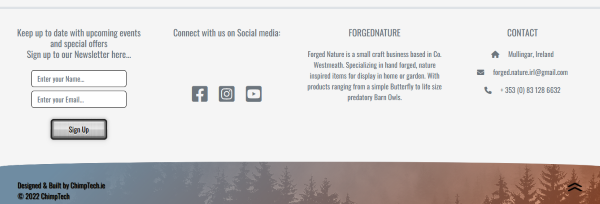

#### Other Pages/Features
[Artist Page](./docs/artist-page.png)

[Shop](./docs/shop.png)

[Cart](./docs/cart.png)

[Checkout](./docs/checkout.png)

[Featured Products](./docs/featured-products.png)

[Newsletter Signup](./docs/newsletter-signup.png)

[Register](./docs/register.png)

[Sign In](./docs/sign-in.png)

* *All form pages follow the same design*

[Site Admin](./docs/Site-Admin.png)

[Individual Product Page](./docs/single-item.png)

[Testimonials](./docs/testimonials.png)

## Future Enhancements
There are several items of functionality that I would like to add in the future. I have left the original user stories that were developed in the project kanban board as future enhancement opportunities.
The key areas I would like to add to the site in the future are:

* The ability for users to login via social networks such as google or facebook
* Other payment options ie. Paypal

AllAuth signup:
The templates for allauth have been changed to suit the style of the site but if the user tries to register for an account with an email that is already in the database there are no warning messages,
the page just reloads, therefore the user is unsure of what went wrong, given a little more time I would like to try to find a way to customize the allauth views so as to include error messages when this happens.

[Back to the Top](#table-of-contents)

---

## Testing

### Testing Strategy
I utilised a manual testing strategy for the development of the site.
Seperate to the functionality testing of the site, and the testing of the code, User Story tests were implemented to ensure that the criteria of the user stories listed above were met.

#### Testing Overview

Testing was divided into different sections to ensure everything was tested individually with test cases developed for each area.

#### Validator Testing
All code files were validated using suitable validators for the specific language.
HTML & CSS code passed the validation.
JavaScript code produced one warning about an undefined variable but this is nothing to worry about as it is defined in another file.
All validation screenshots are included below.

All HTML validation returned the same result so I have included only 1 screenshot here.
## HTML
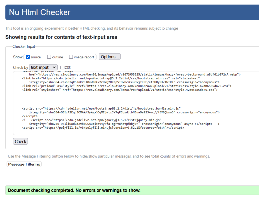
## CSS
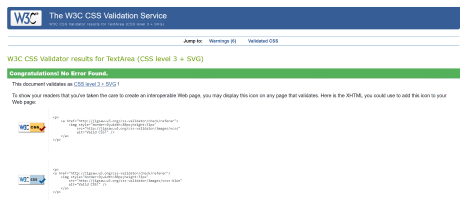
## Script JS
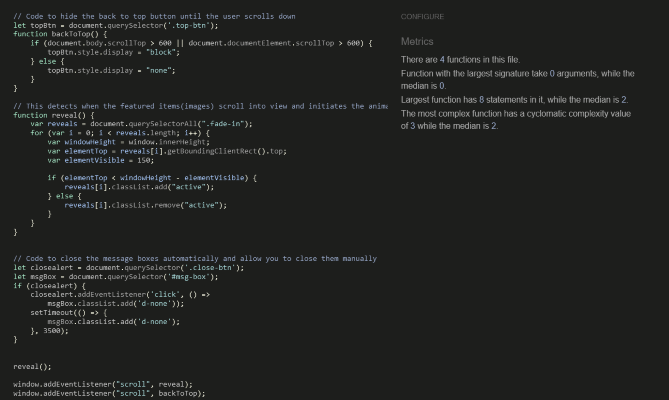
## Stripe JS
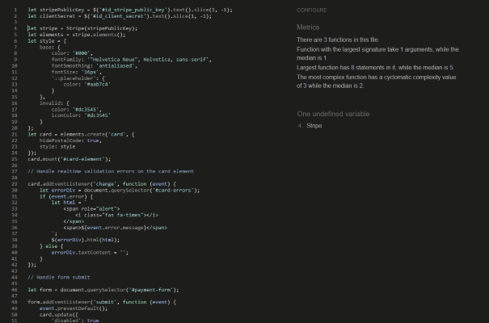
## Quantity Input JS
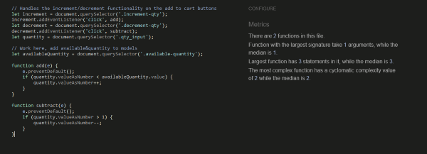

#### Lighthouse Testing
Below you can see the results of Googles Lighthouse Testing.

The desktop results were near perfect but the mobile testing could only produce scores in the low 80's for performance, (all other categories were upwards 0f 90).

The cause of this appeared to be "render blocking resources" & "cache policy".
The "render blocking resources" in question appeared to be Stripe & Bootstrap, I am not sure of how to resolve this issue as those resources are integral to the functionality of the site.
Likewise the cache policy is beyond my grasp, I did a little research on what is needed to fix this and the solution falls outside the realms of this course.

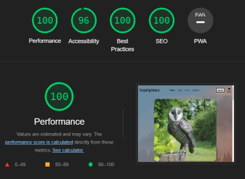
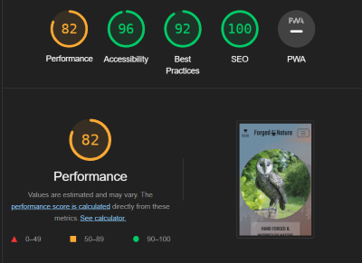

#### Python/JavaScript Testing
All Custom Python & JavaScript code was manually tested multiple times during and after development.
This is reflected in the fact that all of the user stories below are working and have produced no errors in the terminal or the console.

## Testing User Stories

------
User Story:

> Log in/out - As a User, I can log in/out so that I can use the sites functionality and protect my account

Acceptance Criteria:

* Given that I am a registered user, who is not logged in when I navigate to the sign in page and I enter my credentials correctly and press sign in then I am signed into my account.
* Given that I am a registered user, who is currently logged in when I click on the sign out link then I am signed out of my account.
* Given that I am a registered user, who has signed out of my account when I use the browser navigation buttons such as back button then I can not access information which requires me to be signed in.
* Given that I am a user my logged in status should be clear

Implementation of tests:
* Check that the login button triggers the login view and processes the users information.
* Check that the logout button triggers the logout view and the user is successfully logged out.
* Check that when logged out, ensure that the user has no access to restricted pages.
* Check to ensure logged in status is conveyed to the user.

All Tests Passed &#x2611;
---

-----

User Story:

> Reset Password - As a User I can reset my password so that my account stays secure.

Acceptance Criteria:
* Given that I am a registered user, When logging in I should see an option to reset my password.

Implementation of tests:
* Check that upon pressing the password reset button the user is brought to a page to fill in their email details.
* Check that upon entering these details the user receives an email and can successfully change their password.

All Tests Passed &#x2611;
---

-----

User Story:

> Send Welcome Email - As a User I can receive welcome emails so that I am kept informed of my activity.

Acceptance Criteria:
* Given that I am a new user, when I register an account I should receive a welcome email.

Implementation of tests:
* Ensure that functionality to send welcome emails is in place and create an account to test it.

All Tests Passed &#x2611;
---

-----

User Story:

> Logged in status is visible - As a User I can clearly see if I am logged in or not.

Acceptance Criteria:
* Given that I am a registered user, who is not logged in I can see this clearly and login if I want to.
* Given that I am a registered user, who is currently logged in this is clearly visible.
* Given that I am not a registered user I can see this and register if I want to.

Implementation of tests:
* Ensure to clearly show users their current logged in state.
* Redirect users to login or register if they require it.

All Tests Passed &#x2611;
---

-----

User Story:

> Implement Navbar - As a User, I would like to be able to login or logout of my account, so that I can keep my account secure.

Acceptance Criteria:
* Given that I am a user of the website when I use the Navbar. all site navigation is clearly laid out.

Implementation of tests:
* Ensure Navbar is visible and all link are clear and easy to use.

All Tests Passed &#x2611;
---

-----

User Story:

> Home Page - As a User when I first navigate to the page I am directed to the Home/Landing page.

Acceptance Criteria:
* Given that I am a user of the website I am brought to the Home page first.

Implementation of tests:
* Ensure URL for the home page is the first point of contact.

All Tests Passed &#x2611;
---

-----

User Story:

> Easy navigation from landing page - As a User I can navigate through the site from the landing page easily, other pages and purchases should require minimum navigation.

Acceptance Criteria:
* Given that I am a user of the website when I navigate to the landing page there are clear links to the other pages.
* Given that I am a user of the website when I navigate to the landing page there are clear links to purchase items.

Implementation of tests:
* Ensure navigation links to other pages are clear and easy to use.
* Ensure navigation links to purchase items are clear and easy to use.

All Tests Passed &#x2611;
---

-----

User Story:

> View Products - As User I can See a list of products for sale with the ability to click on each item for more information so that I can make informed purchases.

Acceptance Criteria:
* Given that I am a user I can clearly see a list of products available for sale.
* Given that I am a user when I click on any of the products for sale I am brought to a page that displays more information about the product.

Implementation of tests:
* Place some featured items for sale on the home page.
* When clicked these links take the user to the product page.
* Create a stand alone products page which shows all of the products for sale.

All Tests Passed &#x2611;
---

-----

User Story:

>  Create New Products - As a Superuser I can add new products for sale to the database.

Acceptance Criteria:
* Given that I am a Superuser I should see the option to add a product without going to the Admin page.

Implementation of tests:
* Create an "Add Product" button.
* Ensure only logged in Superusers can see the button to create a product.
* Wire up views and URLS for "Add Product" button.
* Ensure new Products are added to the database for other users to see.

All Tests Passed &#x2611;
---

-----

User Story:

> Edit Products - As a Superuser I can Edit products for sale and save changes to the database.

Acceptance Criteria:
* Given that I am a Superuser and logged in I should see the option to Edit a product without going to the Admin page.

Implementation of tests:
* Create an "Edit Product" button.
* Ensure only logged in Superusers can see the button to Edit a product.
* Wire up views and URLS for "Edit Product" button.
* Ensure edited Product details are added to the database for other users to see.

All Tests Passed &#x2611;
---

-----

User Story:

> Delete Products - As a Superuser I can Delete products from the database.

Acceptance Criteria:
* Given that I am a logged in Superuser I should see the option to Delete a product without going to the Admin page.

Implementation of tests:
* Create a "Delete Product" button.
* Only logged in Superusers can see the button to Delete a product.
* Wire up views and URLS for "Delete Product" button.
* Ensure Products are Deleted from the database.

All Tests Passed &#x2611;
---

-----

User Story:

> Add to Cart - As a User I can add products to a shopping Cart.

Acceptance Criteria:
* Given that I am a user when I navigate to a product I wish to purchase then I have the option to add it to a Cart.

Implementation of tests:
* Create an "Add to Cart" button.
* Wire up views and URLS for "Add to Cart" button.
* Ensure items added to the cart are accessible all over the site.

All Tests Passed &#x2611;
---

-----

User Story:

> View Cart - As a User I can View a shopping Cart.

Acceptance Criteria:
* Given that I am a user I can navigate to the Shopping cart page.

Implementation of tests:
* Create a shopping Cart page.
* Wire up views and URLS for Shopping cart page.
* Ensure Cart is visible and accessible all over the site.

All Tests Passed &#x2611;
---

-----

User Story:

> Remove Items from Cart - As a User I can Delete products from my shopping Cart.

Acceptance Criteria:
* Given that I am a user when I navigate to my Cart I can remove products.

Implementation of tests:
* Create a "Delete from Cart" button.
* Wire up views and URLS for "Delete from Cart" button.
* Ensure items deleted are in fact deleted.

All Tests Passed &#x2611;
---

-----

User Story:

> View Cart Total - As a User I can View a running total of the items in the shopping Cart.

Acceptance Criteria:
* Given that I am a user I can navigate to the Shopping cart page and see a total cost of the items contained within.

Implementation of tests:
* Create a function that adds the prices of the items in the cart and displays this to the user.

All Tests Passed &#x2611;
---

-----

User Story:

> User Feedback - As a User I am constantly informed of actions I take on the site.

Acceptance Criteria:
* Given that I am a user I am given Feedback about my actions on the site.

Implementation of tests:
* Implement Django messages and trigger them on each user activity that requires feedback.

All Tests Passed &#x2611;
---

-----

User Story:

> Order Confirmation - As a User I receive a confirmation email if I make a purchase.

Acceptance Criteria:
* Given that I am a user who makes a purchase, I should be shown a confirmation message after the order is placed.

Implementation of tests:
* Implement a confirmation page and trigger it when a user makes a purchase.

All Tests Passed &#x2611;
---

-----

User Story:

> Confirmation Email - As a User who makes a purchase I should receive a confirmation email.

Acceptance Criteria:
* Given that I am a user who makes a purchase, I should receive a confirmation email.

Implementation of tests:
* Implement functionality to send confirmation emails when a user makes a purchase.

All Tests Passed &#x2611;
---

-----

User Story:

> Payment screen - As a User who moves to make a purchase, I should be redirect to a secure payment screen.

Acceptance Criteria:
* Given that I am a user who is making a purchase, I should be redirected to a secure checkout page.

Implementation of tests:
* Implement Stripe payment functionality and payment screen templates.

All Tests Passed &#x2611;
---

-----

User Story:

> Input card Details - As a User who moves to make a purchase, I should be prompted to enter my Credit/Debit card details.

Acceptance Criteria:
* Given that I am a user who is making a purchase, I should be redirected to a secure checkout page and clearly see a space to enter my card details.

Implementation of tests:
* Implement Stripe payment functionality for inputting and processing card payments.

All Tests Passed &#x2611;
---

-----

User Story:

> Create Account - As a User I can Create an account so that I can sign in and avail of the sites full functionality.

Acceptance Criteria:
* Given that I am an unregistered user, When I am on the homepage, Then I can see a button to sign up, And, When I click on the button, Then I am taken to the user registration page.
* Given that I am an unregistered user, And, I am on the user registration page, When I enter my username, email address and password, And, I click on the register button, Then The system creates me an account.

Implementation of tests:
* Create Registration button.
* Link button to views and URL that creates a user account.
* If user is logged in, register button is not visible.

All Tests Passed &#x2611;
---

-----

User Story:

> Delete Account - As a User I can delete my account so that I can remove my footprint from the website if i no longer use it.

Acceptance Criteria:
* Given that I am a registered user when I click on the option to delete my account then I am requested to confirm the request.
* Given that I am a registered user when I click on the option to delete my account And, When I confirm the request then My account is deleted.
* Given that I am a registered user when I delete my account then I should receive confirmation of the account deletion.

Implementation of tests:
* Create a Delete account Button.
* Provide a confirmation page after the delete button is pressed.
* After an account is deleted provide feedback to the user.

All Tests Passed &#x2611;
---

-----

User Story:

> Newsletter - As a User I can sign up to a newsletter to keep up to date with deals and events.

Acceptance Criteria:
* Given that I am a user I can see the option to sign up to the newsletter.

Implementation of tests:
* Create a Newsletter Sign up button.
* Link button to views and URL that adds user to the mailing list.

All Tests Passed &#x2611;
---

-----

User Story:

> Contact Form - As a User I can see an option to contact the artist for inquiries or commissions.

Acceptance Criteria:
* Given that I am a user I can see the option to fill out a contact form so that I can get in touch with the artist directly.

Implementation of tests:
* Create a "Contact me" form.
* Link form to views and URL that sends the artist an email.

All Tests Passed &#x2611;
---

-----

User Story:

> Social Media Links/Contact Info - As a User I can clearly see Social media links and contact info about the artist.

Acceptance Criteria:
* Given that I am a user I can see Social media links, when clicked they take me to the artists Social pages.
* Given that I am a user I can clearly see the artists contact information.

Implementation of tests:
* Include links to all of the artists Social media pages.
* Ensure all links are working.

All Tests Passed &#x2611;
---

-----

User Story:

> View Customer Reviews - As a User I can clearly see past customer testimonials.

Acceptance Criteria:
* Given that I am a user, when I navigate to the home page I can clearly see testimonials from past customers.

Implementation of tests:
* Include customer testimonials section near the bottom of the home page.
* Ensure these are visible to all users on all devices.

All Tests Passed &#x2611;
---

-----

User Story:

> Leave Reviews - As a registered and logged in User I have the option to leave testimonials.

Acceptance Criteria:
* Given that I am a registered and logged in user I can see the option to review the artist and leave a testimonial.

Implementation of tests:
* Include a form for leaving testimonials.
* Ensure testimonials need to be vetted before being posted to the site.

All Tests Passed &#x2611;
---

[Back to the Top](#table-of-contents)

-----

## Bugs

Stripe server error:
I noticed that after the site was deployed to Heroku I could not access the checkout page, I would receive a server error message instead.
Turns out it was an easy fix, I had forgotten to include environment variables in Heroku.

CORS warnings in the console:
During testing I noticed that when using Firefox, when I navigate to the payments page, Lots of CORS warnings show up one after the other.
This does not happen on Chrome, I could not find a solution to this but upon further research I came across information that this could just be a Firefox issue and not limited to my app.

Cart Error:
I noticed that even though I limited the amount of items that could be added to the cart to the total quantity available, this could be bypassed by adding items directly from the cart.
This was fixed in the view by first checking the available stock and only adding items if they were available.

Single-item page error:
In the single item page when trying to select a quantity to add to the cart I noticed that on each press of the + button items were being added to the cart before the add to cart button was pushed.
I found that inside the form that handles this functionality if I changed those + and - buttons from button tags to divs the problem resolved, the button was triggering the form as a whole but the div just operates the increment and decrement functionality leaving the user free to add how ever many products they like and then click add to cart. 

Header background:
I noticed in the dev tools that the background for the header was cutting off the bottom of the video element. So I incresed the height until it looked good.
BUT then I noticed that on real tablets that it was much too big, leaving lots of empty space.
In the devtools the tablet setting is the correct width but the height is less than the width and since most people will hold a tablet portrait style when browsing the internet I once again changed the height of the header to fit with this conclusion.

[Back to the Top](#table-of-contents)

-----

## Technologies

* Python
* Django
    * Django was used as the main python framework in the development of this project.
* Heroku
    * Was used as the cloud based platform to deploy the site on.
* Heroku PostgreSQL
    * Heroku PostgreSQL was used as the database for this project during development and in production.
* JavaScript
    * Custom JavaScript was utilised to allow Users to close site messages and increment/decrement cart items.
* Bootstrap 5
    * Bootstrap was used for general layout and spacing requirements for the site.
* Font Awesome
    * Was used for access to several icons for different sections where icons were appropriate.
* CSS
    * Custom css was written for a large number of areas on the site to implement custom styling and escape a bootstrap look and feel to the site.
* Jinja/Django Templating
    * Jinja/Django templating language was utilised to insert data from the database into the sites pages. It was also utilised to perform queries on different datasets.
* HTML
    * HTML was used as the base language for the templates created for the site.
* Stripe
    * Stripe was used to allow the store to accept card payments.

#### Packages Used

* VS Code & Gitpod was used to develop the site
* Git was utilised for version control and transferring files between the code editor and the repository
* GitHub was utilised for storing the files for this project

#### Resources Used

* The Django documentation was used extensively during development of this project
* The Cloudinary documentation was used.
* The Code Institute reference material was used as a general reference for things that I had previously done during the course.
* All other resources used are referenced where appropriate.

[Back to the Top](#table-of-contents)

----

## Deployment

The site was deployed via Heroku, and the live link can be found here - [Forged Nature](https://rossanthonydesigns.herokuapp.com/)

### Project Deployment

To deploy the project through Heroku I followed these steps:
* Sign up / Log in to [Heroku](https://www.heroku.com/)
* From the main Heroku Dashboard page select 'New' and then 'Create New App'
* Give the project a name - I entered RossAnthonyDesigns and select a suitable region, then select create app. The name for the app must be unique.
* This will create the app within Heroku and bring you to the deploy tab. From the submenu at the top, navigate to the resources tab.
* Add the database to the app, in the add-ons section search for 'Heroku Postgres', select the package that appears and add 'Heroku Postgres' as the database
* Navigate to the setting tab, within the config vars section copy the DATABASE_URL to the clipboard for use in the Django configuration.
* Within the django app repository create a new file called env.py - within this file import the os library and set the environment variable for the DATABASE_URL pasting in the address copied from Heroku. The line should appear as os.environ["DATABASE_URL"]= "Paste the link in here"
* Add a secret key to the app using os.environ["SECRET_KEY"] = "your secret key goes here"
* Add the secret key just created to the Heroku Config Vars as SECRET_KEY for the KEY value and the secret key value you created as the VALUE
* In the settings.py file within the django app, import Path from pathlib, import os and import dj_database_url
* insert the line if os.path.isfile("env.py"): import env
* remove the insecure secret key that django has in the settings file by default and replace it with SECRET_KEY = os.environ.get('SECRET_KEY')
* replace the databases section with DATABASES = { 'default': dj_database_url.parse(os.environ.get("DATABASE_URL"))} ensure the correct indentation for python is used.
* In the terminal migrate the models over to the new database connection
* Navigate in a browser to cloudinary, log in, or create an account and log in. 
* From the dashboard - copy the CLOUDINARY_URL to the clipboard
* in the env.py file created earlier - add os.environ["CLOUDINARY_URL"] = "paste in the Url copied to the clipboard here"
* In Heroku, add the CLOUDINARY_URL and value copied to the clipboard to the config vars
* Also add the KEY - DISABLE_COLLECTSTATIC with the Value - 1 to the config vars
* this key value pair must be removed prior to final deployment
* Add the cloudinary libraries to the list of installed apps, the order they are inserted is important, 'cloudinary_storage' goes above 'django.contrib.staticfiles' and 'cloudinary' goes below it.
* in the Settings.py file - add the STATIC files settings - the url, storage path, directory path, root path, media url and default file storage path.
* Link the file to the templates directory in Heroku TEMPLATES_DIR = os.path.join(BASE_DIR, 'templates')
* Change the templates directory to TEMPLATES_DIR - 'DIRS': [TEMPLATES_DIR]
* Add Heroku to the ALLOWED_HOSTS list the format will be the app name given in Heroku when creating the app followed by .herokuapp.com
* In your code editor, create three new top level folders, media, static, templates
* Create a new file on the top level directory - Procfile
* Within the Procfile add the code - web: gunicorn PROJECT_NAME.wsgi
* In the terminal, add the changed files, commit and push to GitHub
* In Heroku, navigate to the deployment tab and deploy the branch manually - watch the build logs for any errors.
* Heroku will now build the app for you. Once it has completed the build process you will see a 'Your App Was Successfully Deployed' message and a link to the app to visit the live site.

#### Forking the repository
By forking the GitHub Repository you can make a copy of the original repository to view or change without it effecting the original repository
This can be done by
* Log into GitHub or create an account.
* Locate the repository at https://github.com/KSheridan86/project-5-RossAnthonyDesigns .
* At the top of the repository, on the right side of the page, select "Fork" from the buttons available.
* A copy of the repository should now be created in your own repository.

#### Create a clone of this repository
Creating a clone enables you to make a copy of the repository at that point in time - this lets you run a copy of the project locally:
This can be done by:
* Navigate to https://github.com/KSheridan86/project-5-RossAnthonyDesigns
* click on the arrow on the green code button at the top of the list of files
* select the clone by https option and copy the URL it provides to the clipboard
* navigate to your code editor of choice and within the terminal change the directory to the location you want to clone the repository to.
* type 'git clone' and paste the https link you copied from github
* press enter and git will clone the repository to your local machine

[Back to the Top](#table-of-contents)

-----

## Credits

All Images used across the site are original and where created just for this project except for the header/footer background which was sourced from pexels.com.
The Black Icons used across the site were sourced from fontawesome and flaticon.com, attributions below.

- The Anvil Icon, (<a href="https://www.flaticon.com/free-icons/anvil" title="anvil icons">Anvil icons created by Agung Rama - Flaticon</a>) 
- The Back to Top Icon (<a href="https://www.flaticon.com/free-icons/double-arrow" title="double arrow icons">Double arrow icons created by Rahul Kaklotar - Flaticon</a>)
- Error 404 Icon (<a href="https://www.flaticon.com/free-icons/error-404" title="error 404 icons">Error 404 icons created by Freepik - Flaticon</a>)
- Server Error Icon (<a href="https://www.flaticon.com/free-icons/error" title="error icons">Error icons created by Pixel perfect - Flaticon</a>)
- Tick Icon (<a href="https://www.flaticon.com/free-icons/tick" title="tick icons">Tick icons created by kliwir art - Flaticon</a>)
- All other small images including Social media links were sourced from Font Awesome.

I relied heavily on the Code institute course work, particularly the Django walk through projects.
Further research was done by building walk through projects available freely on youtube and Dennis Ivy's Django/Python course on Udemy.

-----

## Acknowledgements

I would like to acknowledge the help and support given by my mentor [Chris Quinn](https://github.com/10xOXR), he is never short of good ideas. 
All of the students in my own study group aswell as all the students in the wider Code Institute Slack channels. My cohort Facilitator [Kasia](https://github.com/bezebee) and all of the staff at Code Institute. The sense of comraderie among all of these individuals has helped me to feel at home on my journey to a new career in programming.

On top of all these wonderful people I can't forget to thank my wife Rebecca for her help and understanding (and cups of tea!), without which none of this would be possible.

-----

## Author Info

Ken Sheridan, Full Stack Software Developer.
- [GitHub](https://github.com/KSheridan86)
- [Linkedin](https://www.linkedin.com/in/kensheridan86/)

[Back to the Top](#table-of-contents)